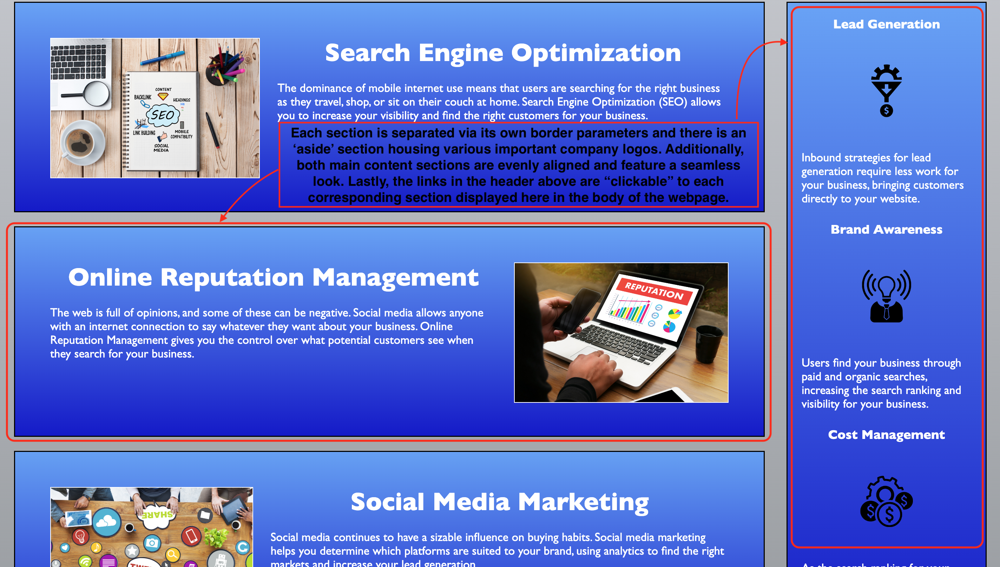

# **Organize HTML Semantics** [](#isc-license)

## Overview 
---
Improving the organization of provided code, ensures a smooth operating webpage and/or application.

**Refactoring** existing code to meet a certain set of standards or to implement a new technology will the technique used to improve the **Horiseon** webpage.

> **Important**: When working with someone else's code, you should adhere to the **Scout Rule**&mdash;always leave the code a little cleaner than when you found it.

The main goal of **Refractoring** is too improve the accessibility of the **Horiseon** webpage for all users across the board. Specifically, the utilization of semantics for the ```HTML``` and ```CSS``` source codes will improve the navigation capability of the website for all users.

## Table of Contents
---

  * [Overview](#overview)
  * [Acceptance Criteria](#acceptance-criteria)
  * [Mock Up](#mock-up)
  * [Deployed Webpage](#deployed-webpage)
  * [GitHUB Repository](#github-repository)
  * [Evaluation Guideline](#evaluation-guideline)
  * [Questions](#questions)
  * [License](#isc-license)

## Acceptance Criteria
---
> **Note:** The following criteria is used to determine if the standards set for the **Horiseon** webpage have been met:
```
GIVEN a webpage meets accessibility standards
WHEN I view the source code
THEN I find semantic HTML elements
WHEN I view the structure of the HTML elements
THEN I find that the elements follow a logical structure independent of styling and positioning
WHEN I view the icon and image elements
THEN I find accessible alt attributes
WHEN I view the heading attributes
THEN they fall in sequential order
WHEN I view the title element
THEN I find a concise, descriptive title
```

## Mock-Up
---
> **Note:** The following image shows the web application's appearance and functionality to be used as a standard:


### Header
----


### Main Content
----


## Deployed Webpage
---
> https://aasports89.github.io/organize-HTML-semantics/

## GitHUB Repository
---
> https://github.com/AASports89/organize-HTML-semantics

> **Important**: This layout is designed for desktop viewing, so you may notice that some of the elements don't look like the mock-up at a resolution smaller than 768px. 

## Evaluation Guideline
---
> **Note**: The following evaluation guideline is used to determine if the **Horiseon** website meets the accessibility requirements:

This Challenge is graded based on the following criteria: 

### Technical Acceptance Criteria: 40%

* Satisfies all of the preceding acceptance criteria plus the following code improvements:

  * Application's links all function correctly.

  * Application's CSS selectors and properties are consolidated and organized to follow semantic structure.

  * Application's CSS file is properly commented.

### Deployment: 32%

* Application deployed at live URL.

* Application loads with no errors.

* Application GitHub URL submitted.

* GitHub repository contains application code.

### Application Quality: 15%

* Application resembles mock-up provided in the Challenge instructions (at least 90%).

### Repository Quality: 13%

* Repository has a unique name.

* Repository follows best practices for file structure and naming conventions.

* Repository follows best practices for class/id naming conventions, indentation, quality comments, etc.

* Repository contains multiple descriptive commit messages.

* Repository contains quality README file with description, screenshot, and link to deployed application.

## Questions
---
> **Note:** For any troubleshooting and/or functionality related questions, please visit my GitHUB @https://github.com/AASports89/organize-HTML-semantics

## **ISC License**
---
**Copyright © 2022 - AASports89**

Permission to use, copy, modify, and/or distribute this software for any purpose with or without fee is hereby granted, provided that the above copyright notice and this permission notice appear in all copies.

THE SOFTWARE IS PROVIDED "AS IS" AND THE AUTHOR DISCLAIMS ALL WARRANTIES WITH REGARD TO THIS SOFTWARE INCLUDING ALL IMPLIED WARRANTIES OF MERCHANTABILITY AND FITNESS. IN NO EVENT SHALL THE AUTHOR BE LIABLE FOR ANY SPECIAL, DIRECT, INDIRECT, OR CONSEQUENTIAL DAMAGES OR ANY DAMAGES WHATSOEVER RESULTING FROM LOSS OF USE, DATA OR PROFITS, WHETHER IN AN ACTION OF CONTRACT, NEGLIGENCE OR OTHER TORTIOUS ACTION, ARISING OUT OF OR IN CONNECTION WITH THE USE OR PERFORMANCE OF THIS SOFTWARE.

---
---